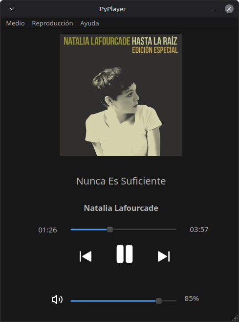

# PyPlayer

Un reproductor de música simple para escritorio hecho en Python

## Características

- Lectura de metadatos
- Portadas embebidas (mp3, flac, m4a)

## Captura
<p align="center">
  
</p>

## Tecnologías

- Python
- PySide6 (Binding de Qt)
- Mutagen

## Dependencias

Instala las dependencias con:
```bash
pip install -r requeriments.txt
```

## Uso

```bash
python music_player.py
```

## Nota

Proyecto realizado como práctica de Python y desarrollo de interfaces gráficas de escritorio.
